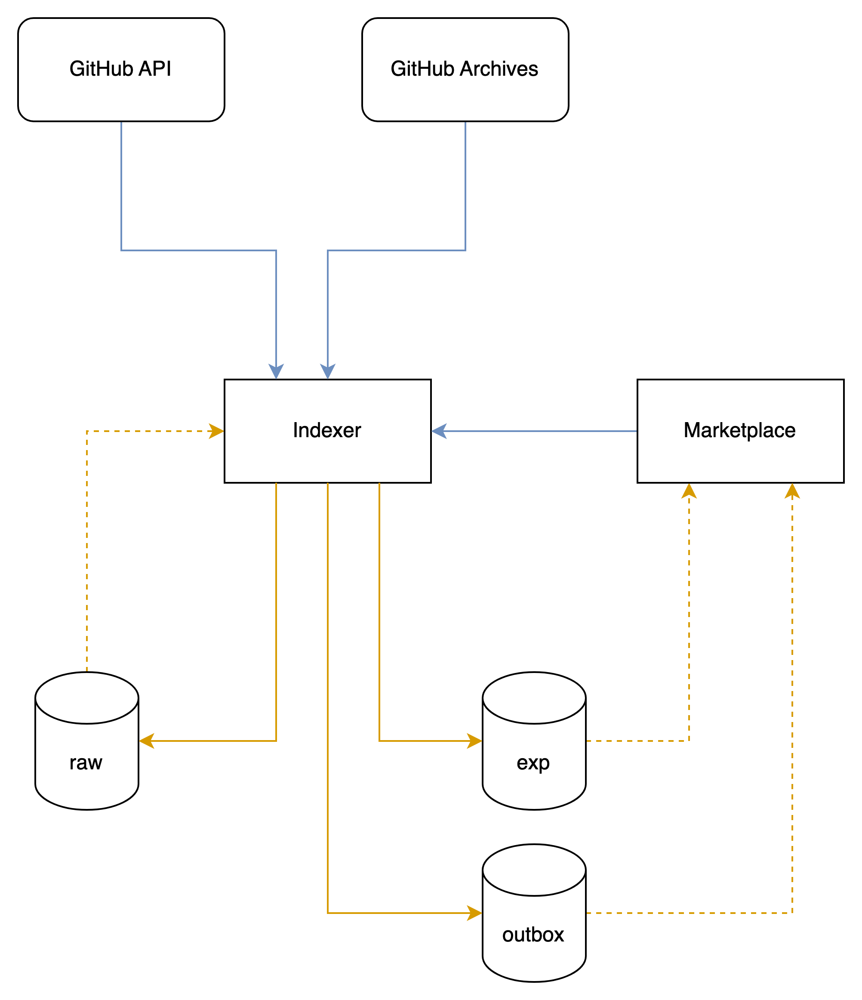

# marketplace-indexer

The main purpose of this project is to index different objects from GitHub and expose them for OnlyDust marketplace.
The following GitHub objects are indexed:

* Users
* Repositories
* Issues
* Pull Requests
* Code reviews
* Commits

## How does it work?

The project is built following the hexagonal architecture.

The database is built as a data lake, organized into 4 different schemas:

* **indexer**: This is the main DB schema, used to store core data, like job statuses
* **indexer_raw**: This schema is used to store `raw` data from the GitHub API
* **indexer_exp**: This schema is used to store the `exposed` data for the marketplace
* **indexer_outbox**: This schema is used to store the outgoing events

The `clean` data is represented in-memory as Java objects, not persisted for the time being.

The `Indexer` purpose is to read data from a `RawStorageReader` and build the `clean` model.
This allows any indexer to be decorated to add new features, like caching.

The `Exposer` is an `Indexer` decorator that read the `clean` model and write the `exposition` model.

There are currently 2 cache-related decorators implemented:

* `CacheReadRawStorageReaderDecorator`: This cache is used to cache the `RawStorageReader` reads
* `CacheWriteRawStorageReaderDecorator`: This cache is used to store in the cache the data read from the `RawStorageReader`

Several indexers are implemented, each one with a given purpose:

* `UserIndexer`: Indexes GitHub users, including its social accounts
* `RepoIndexer`: Indexes GitHub repositories, including its languages
* `FullRepoIndexer`: Indexes GitHub repositories including the issues and pull requests
* `IssueIndexer`: Indexes GitHub issues, including the assignees
* `PullRequestIndexer`: Indexes GitHub pull requests, including the reviews and commits

Each indexer is decorated into several flavors:

* `cacheOnly`: This flavors only reads the raw storage from the cache, used mainly for refresh purposes.
* `live`: This flavor reads the raw storage from the cache, if not found, reads from the GitHub API and store the result in the cache. This is used for the main
  indexing processes.
* `diff`: This flavor works like the `live` flavor but only reads incremental changes from the GitHub API.

## GithubApp events

The project contains a webhook that listens to GitHubApp events.
When an event is received, the relevant indexers are triggered to update the data.

## Jobs

The project contains a job scheduler that triggers the indexers to update the data on a regular basis, in case of missed events.

## GitHub public events

When a user registers in the marketplace, a request is sent to this repo to index the user.
For this purpose, all public events related to the user are fetched and indexed.

2 sources of public events are used:

* **[Github Archives](https://www.githubarchive.org/)**: We fetch the public events using the public BigQuery dataset from user account creation date to the day
  before the current date.
* **Github API**: We fetch the current day events from the GitHub API.

In order to avoid hitting the GitHub API rate limit, the public events indexing process works as follows:

1. Public events are fetched and stored in the `indexer_raw` schema.
2. `raw` inner objects(like repos, pull requests, issues) are read from the events and stored in the `indexer_raw` schema.
3. Some mandatory objects are indexed using `live` indexers.
    * For example, in the case of a pull request event, the repo and its owner are indexed using the `live` indexers.
4. The relevant indexers are then triggered to expose the data. `cacheOnly` indexers are used to avoid fetching the GitHub API.

A `Job` is run on a regular basis to fetch all users public events and index them.

## User languages indexing

The user languages are computed by the marketplace based on the file extensions of the commits the user has made.
However, the modified files are not part of the GitHub public events. A dedicated call to the GitHub API, per commit, must be made to fetch them.

In order to avoid hitting the GitHub API rate limit, a sampling mechanism is used:

**TODO**: _Add the sampling mechanism description_